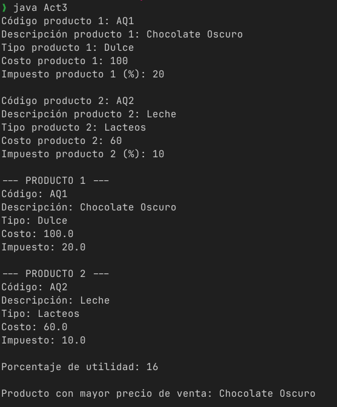

# Documentación de la actividad 3

---
En Java, crea una clase llamada Producto con las siguientes características:
La clase debe tener los siguientes atributos privados (private):

|  Atributo | Tipo |
|-----------|------|
|descripción|String|
|código     |String|
|tipo       |String|
|costo      |Double|
|impuesto   |Double|

Incluye un método de acceso (get) para cada atributo privado. Recuerda que estos elementos devuelven el valor del atributo y, por tanto, deben ser públicos (public).
Incluye un método “establecedor” (set) para cada atributo privado. Recuerda que estos elementos asignan un valor a los atributos, por lo que no devuelven ningún valor y, por ese motivo, también deben ser públicos.
Incluye un método público llamado muestraProducto que presente el valor de todos los atributos en pantalla.
Incluye un método funcional que calcule y devuelva el precio de venta del producto, de acuerdo con los siguientes requisitos:
El método debe recibir un parámetro de tipo double que se llame utilidad, cuyo valor corresponde al porcentaje de utilidad que se quiere manejar para el producto.
Al costo, se le debe sumar el porcentaje de utilidad; por ejemplo, si el primero es de $100 y la segunda de 20%, el precio antes de impuestos es de $120.
Finalmente, a dicho precio, se le debe sumar el impuesto; entonces, si este es del 16%, el precio de venta total se calcula a partir de la suma de $120 + $16.2, la cual arroja un total de $139.2. Este es el valor que debe devolver el método.
El nombre del método debe ser calcularPrecio.

En la clase principal (main) del programa, realiza las siguientes acciones:
Crea dos objetos de la clase Producto, pide al usuario el valor de todos los atributos y asígnalos mediante los métodos establecedores (set).
Incluye sentencias try-catch para captar excepciones que se puedan presentar en la entrada de datos.
Muestra, en pantalla, los valores de los atributos de los dos objetos a través del método mostrarProducto().
Crea un método estático llamado compararProductos que reciba dos parámetros de tipo Producto; dentro de él, invoca el método de clase calcularPrecio para cada uno de los productos recibidos como argumentos y, luego, determina cuál es mayor. El método debe devolver un String con la descripción del producto con el mayor precio de venta.
Desde la clase principal (main), invoca el método compararProductos y muestra el resultado en la pantalla.

---

## Codigo  

```java
import java.util.Scanner;

class Producto {
  private String codigo;
  private String descripcion;
  private String tipo;
  private Double costo;
  private Double impuesto;

  public String getCodigo() {
    return codigo;
  }

  public String getDescripcion() {
    return descripcion;
  }

  public String getTipo() {
    return tipo;
  }

  public Double getCosto() {
    return costo;
  }

  public Double getImpuesto() {
    return impuesto;
  }

  public void setCodigo(String codigo) {
    this.codigo = codigo;
  }

  public void setDescripcion(String descripcion) {
    this.descripcion = descripcion;
  }

  public void setTipo(String tipo) {
    this.tipo = tipo;
  }

  public void setCosto(Double costo) {
    this.costo = costo;
  }

  public void setImpuesto(Double impuesto) {
    this.impuesto = impuesto;
  }

  public void muestraProducto() {
    System.out.println("Código: " + codigo);
    System.out.println("Descripción: " + descripcion);
    System.out.println("Tipo: " + tipo);
    System.out.println("Costo: " + costo);
    System.out.println("Impuesto: " + impuesto);
  }

  public double calcularPrecio(double utilidad) {
    double precioConUtilidad = costo + (costo * utilidad / 100);
    double montoImpuesto = precioConUtilidad * (impuesto / 100);
    return precioConUtilidad + montoImpuesto;
  }
}

public class Act3 {
  public static String compararProductos(Producto p1, Producto p2, double utilidad) {
    double precio1 = p1.calcularPrecio(utilidad);
    double precio2 = p2.calcularPrecio(utilidad);
    if (precio1 > precio2) {
      return p1.getDescripcion();
    } else if (precio2 > precio1) {
      return p2.getDescripcion();
    } else {
      return "Ambos productos tienen el mismo precio de venta";
    }
  }

  public static void main(String[] args) {
    Scanner sc = new Scanner(System.in);
    Producto p1 = new Producto();
    Producto p2 = new Producto();
    try {
      System.out.print("Código producto 1: ");
      p1.setCodigo(sc.nextLine());
      System.out.print("Descripción producto 1: ");
      p1.setDescripcion(sc.nextLine());
      System.out.print("Tipo producto 1: ");
      p1.setTipo(sc.nextLine());
      System.out.print("Costo producto 1: ");
      p1.setCosto(sc.nextDouble());
      System.out.print("Impuesto producto 1 (%): ");
      p1.setImpuesto(sc.nextDouble());
      sc.nextLine();
      System.out.print("\nCódigo producto 2: ");
      p2.setCodigo(sc.nextLine());
      System.out.print("Descripción producto 2: ");
      p2.setDescripcion(sc.nextLine());
      System.out.print("Tipo producto 2: ");
      p2.setTipo(sc.nextLine());
      System.out.print("Costo producto 2: ");
      p2.setCosto(sc.nextDouble());
      System.out.print("Impuesto producto 2 (%): ");
      p2.setImpuesto(sc.nextDouble());
    } catch (Exception e) {
      System.out.println("Error en la entrada de datos.");
      sc.close();
      return;
    }
    System.out.println("\n--- PRODUCTO 1 ---");
    p1.muestraProducto();
    System.out.println("\n--- PRODUCTO 2 ---");
    p2.muestraProducto();
    System.out.print("\nPorcentaje de utilidad: ");
    double utilidad = sc.nextDouble();
    String resultado = compararProductos(p1, p2, utilidad);
    System.out.println("\nProducto con mayor precio de venta: " + resultado);
    sc.close();
  }
}
```

---  

**Salida esperada**  

---
