# 15 ejercicios integrados de Java (niveles mixtos)

Incluyen: tipos de datos, operadores, condicionales, estructuras repetitivas,
arreglos, métodos, clases/objetos y manejo básico de errores
---

## 1. Suma simple con validación de entrada (fácil)

**Enunciado**
Escribe un programa que pida al usuario dos números enteros, valide que realmente
sean enteros usando manejo de errores, y luego muestre la suma de ambos.
**Codigo**

```java
import java.util.InputMismatchException;
import java.util.Scanner;

public class ejercicio1 {
    public static void main(String[] args) {
        Scanner sc = new Scanner(System.in);
        try {
            System.out.print("Primer numero: ");
            int num1 = sc.nextInt();
            System.out.print("Segundo numero: ");
            int num2 = sc.nextInt();
            System.out.println("La suma de " + num1 + " y " + num2 + " es: " + (num1+num2));
        } catch (InputMismatchException ex) {
            System.out.println("Debes ingresar un número entero");
        }
        }        
}
```

**Salida esperada**
---

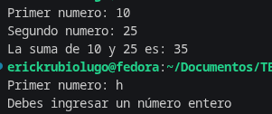
---

## 2. Clasificación de edad con mensaje personalizado (fácil)

**Enunciado**
Pide el nombre y la edad del usuario.
Usa condicionales para mostrar:

- Menos de 13: "Hola <nombre>, eres un niño."
- 13 a 17: "Hola <nombre>, eres un adolescente."
- 18 a 64: "Hola <nombre>, eres un adulto."
- 65 o más: "Hola <nombre>, eres un adulto mayor."
**Codigo**

```java
import java.util.Scanner;

public class ejercicio2 {
    public static void main(String[] args) {
        Scanner sc = new Scanner(System.in);
        System.out.print("Ingresa tu nombre: ");
        String nombre = sc.nextLine();
        System.out.print("Ingresa tu edad: ");
        int edad = sc.nextInt();
        if (edad < 14) {
            System.out.println("Hola " + nombre + ", eres un niño");
        } else if (edad > 13 && edad < 18) {
            System.out.println("Hola " + nombre + ", eres un adolescente");
        } else if (edad > 17 && edad < 66) {
            System.out.println("Hola " + nombre + ", eres un adulto");
        } else if (edad > 65) {
            System.out.println("Hola " + nombre + ", eres un adulto mayor");
        }
    }
}

```

**Salida esperada**
---

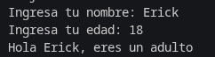
---

## 3. Tabla de multiplicar con `for` (fácil)

**Enunciado**
Pide un número entero entre 1 y 10.
Muestra su tabla de multiplicar del 1 al 10 usando un ciclo `for`.
Si el usuario ingresa algo no entero, usa manejo de errores para pedir el dato de
nuevo.
**Codigo**

```java
import java.util.InputMismatchException;
import java.util.Scanner;

public class ejercicio3 {
    public static void main(String[] args) {
        Scanner sc = new Scanner(System.in);
        try {
            System.out.print("Ingresa un número del 1 al 10 para mostrar su tabla: ");
            int num = sc.nextInt();
            if (num < 0 || num > 10) {
                System.out.println("Solo puede ser del 1 al 10");
            } else {
                for (int i = 1; i < 11; i++) {
                    System.out.println(num + " * " + i + " = " + (num*i));
                }
            }
        } catch (InputMismatchException ex) {
            System.out.println("Ingresa un número entero");
        }
    }
}
```

**Salida esperada**
---

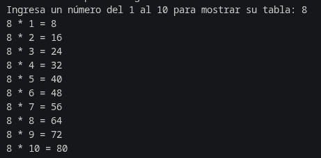
---

## 4. Arreglo de calificaciones y promedio (fácil–medio)

**Enunciado**
Pide al usuario cuántas calificaciones desea capturar (máximo 10).
Luego pide cada calificación (double) y guárdalas en un arreglo.
Calcula y muestra:

- El promedio.
- Cuántas calificaciones son mayores o iguales a 70 (aprobadas).
- Cuántas son menores a 70 (reprobadas).
**Entrada (ejemplo)**

```java
import java.util.Scanner;

public class ejercicio4 {
    public static void main(String[] args) {
        Scanner sc = new Scanner(System.in);
        System.out.print("¿Cuántas materias hay?: ");
        int num = sc.nextInt();
        double[] calf = new double[num];
        double total = 0;
        for (int i = 0; i < num; i ++) {
            System.out.println("Ingresa la calificación: ");
            calf[i] = sc.nextDouble();
            total = total + calf[i];
        }
        double prom = total / num;
        int aprob = 0;
        int reprob = 0;
        for (int i = 0; i < num; i ++) {
            if (calf[i] >= 70) {
                aprob = aprob + 1;
            } else {
                reprob = reprob + 1;
            }
        }
        System.out.println("Promedio: " + prom);
        System.out.println("Aprobadas: " + aprob);
        System.out.println("Reprobadas: " + reprob);
    }
}
```

**Salida esperada**
---

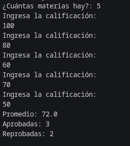
---

## 5. Contador de vocales y consonantes en una palabra (medio)

**Enunciado**
Pide al usuario una palabra (sin espacios).
Convierte la palabra a minúsculas y recórrela carácter por carácter.
Cuenta cuántas vocales (a, e, i, o, u) y cuántas consonantes (letras que no son
vocales).
Ignora caracteres que no sean letras.
**Codigo**

```java
import java.util.Scanner;

public class Ejercicio5 {
  public static void main(String[] args) {
    Scanner sc = new Scanner(System.in);
    System.out.print("Ingresa una palbara sin espacios: ");
    String palabra = sc.nextLine();
    String minuscula = palabra.toLowerCase();
    char[] caracteres = minuscula.toCharArray();
    int vocales = 0;
    int consonantes = 0;
    for (int i = 0; i < caracteres.length; i++) {
      if (caracteres[i] == 'a' || caracteres[i] == 'e' || caracteres[i] == 'i' || caracteres[i] == 'o'
          || caracteres[i] == 'u') {
        vocales = vocales + 1;
      } else {
        consonantes = consonantes + 1;
      }
    }
    System.out.println("vocales: " + vocales);
    System.out.println("consonantes: " + consonantes);
  }
}
```

**Salida esperada**
---

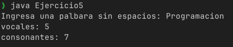
---

## 6. Verificar si un arreglo está ordenado (medio)

**Enunciado**
Pide n números enteros y guárdalos en un arreglo.
Escribe un método estático que reciba el arreglo y regrese true si está ordenado de
forma ascendente (cada elemento >= anterior), o false en caso contrario.
Desde main, muestra un mensaje indicando si el arreglo está ordenado.
**Codigo**

```java
import java.util.Scanner;

public class Ejercicio6 {
  public static boolean orden(int[] a) {
    for (int i = 1; i < a.length; i++) {
      if (a[i] < a[i - 1]) {
        return false;
      }
    }
    return true;
  }

  public static void main(String[] args) {
    Scanner sc = new Scanner(System.in);
    System.out.print("¿Cuántos números enteros vas a guardar?: ");
    int len = sc.nextInt();
    int[] numbers = new int[len];
    for (int i = 0; i < numbers.length; i++) {
      System.out.print("Ingresa el número " + i + ": ");
      numbers[i] = sc.nextInt();
    }
    if (orden(numbers)) {
      System.out.println("El arreglo está ordenado.");
    } else {
      System.out.println("El arreglo no está ordenado.");
    }
  }
}
```

**Salida esperada**
---

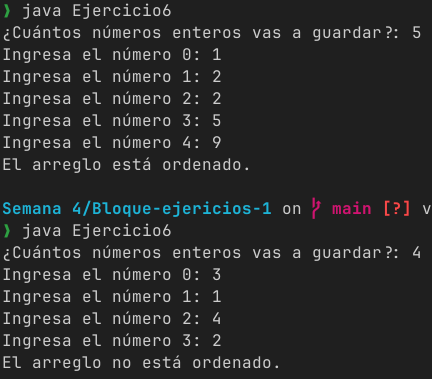
---

## 7. Clase Rectangulo con métodos de área y perímetro (medio)

**Enunciado**
Crea una clase `Rectangulo` con atributos privados ancho y alto (double).
Incluye:

- Constructor que reciba ancho y alto.
- Getters y setters.
- Método `calcularArea()` que regrese el área.
- Método `calcularPerimetro()` que regrese el perímetro.
En main:
- Pide al usuario ancho y alto (con manejo de errores).
- Crea un objeto Rectangulo.
- Muestra su área y perímetro.
**Codigo**

```java
import java.util.Scanner;

class Rectangulo {
  private double ancho;
  private double alto;

  public Rectangulo(double ancho, double alto) {
    this.ancho = ancho;
    this.alto = alto;
  }

  public double getAncho() {
    return ancho;
  }

  public double getAlto() {
    return alto;
  }

  public void setAncho(double ancho) {
    this.ancho = ancho;
  }

  public void setAlto(double alto) {
    this.alto = alto;
  }

  public double calcularArea() {
    return ancho * alto;
  }

  public double calcularPerimetro() {
    return 2 * (ancho + alto);
  }
}

public class Ejercicio7 {
  public static void main(String[] args) {
    Scanner sc = new Scanner(System.in);
    double ancho = 0;
    double alto = 0;
    try {
      System.out.print("Ancho: ");
      ancho = sc.nextDouble();
      System.out.print("Alto: ");
      alto = sc.nextDouble();
      if (ancho <= 0 || alto <= 0) {
        System.out.println("El ancho y el alto deben ser positivos.");
        return;
      }
      Rectangulo r = new Rectangulo(ancho, alto);
      System.out.println("Área: " + r.calcularArea());
      System.out.println("Perímetro: " + r.calcularPerimetro());
    } catch (Exception e) {
      System.out.println("Error: debes ingresar valores numéricos.");
    }
  }
}
```

**Salida esperada**
---

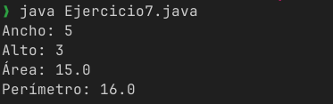
---

## 8. Buscar un número en un arreglo (medio)

**Enunciado**
Pide n enteros y guárdalos en un arreglo.
Luego pide un número x a buscar.
Usa un método estático buscarElemento(int[] arr, int x) que regrese el índice donde
se encuentra la primera ocurrencia de x, o -1 si no existe.
En main, muestra un mensaje adecuado.
**Codigo**

```java
import java.util.Scanner;

public class Ejercicio8 {
  public static int buscarElemento(int[] arr, int x) {
    for (int i = 0; i < arr.length; i++) {
      if (arr[i] == x) {
        return i;
      }
    }
    return -1;
  }

  public static void main(String[] args) {
    Scanner sc = new Scanner(System.in);
    System.out.print("¿Cuantos numeros son?: ");
    int n = sc.nextInt();
    int[] arreglo = new int[n];
    System.out.println("Ingresa los elementos del arreglo:");
    for (int i = 0; i < n; i++) {
      arreglo[i] = sc.nextInt();
    }
    System.out.print("Número a encontrar: ");
    int x = sc.nextInt();
    int indice = buscarElemento(arreglo, x);
    if (indice != -1) {
      System.out.println("El número " + x + " se encontró en el índice: " + indice);
    } else {
      System.out.println("El número " + x + " no se encuentra en el arreglo.");
    }
  }
}```
**Salida esperada**
--- 

---

## 9. Sistema simple de biblioteca con clase Libro (medio–alto)

**Enunciado**
Crea una clase Libro con:
Atributos privados: titulo (String), autor (String), totalEjemplares (int),
ejemplaresPrestados (int).
Getters y setters.
Método prestar() que:
Si hay ejemplares disponibles (totalEjemplares - ejemplaresPrestados > 0), aumente
ejemplaresPrestados y regrese true.
En otro caso regrese false.
Método devolver() que:
Si ejemplaresPrestados > 0, lo disminuye y regresa true.
En otro caso regresa false.
Método mostrarInfo() que muestre todos los datos.
En main:
Crea un objeto Libro con datos fijos.
Muestra un menú con while o do-while para:

- Ver información del libro.
- Prestar un ejemplar.
- Devolver un ejemplar.
- Salir.
**Codigo**
```java 
import java.util.Scanner;

class Libro {
  private String titulo;
  private String autor;
  private int totalEjemplares;
  private int ejemplaresPrestados;

  public Libro(String titulo, String autor, int totalEjemplares) {
    this.titulo = titulo;
    this.autor = autor;
    this.totalEjemplares = totalEjemplares;
    this.ejemplaresPrestados = 0;
  }

  public String getTitulo() {
    return titulo;
  }

  public void setTitulo(String titulo) {
    this.titulo = titulo;
  }

  public String getAutor() {
    return autor;
  }

  public void setAutor(String autor) {
    this.autor = autor;
  }

  public int getTotalEjemplares() {
    return totalEjemplares;
  }

  public void setTotalEjemplares(int totalEjemplares) {
    this.totalEjemplares = totalEjemplares;
  }

  public int getEjemplaresPrestados() {
    return ejemplaresPrestados;
  }

  public boolean prestar() {
    if (totalEjemplares - ejemplaresPrestados > 0) {
      ejemplaresPrestados++;
      return true;
    }
    return false;
  }

  public boolean devolver() {
    if (ejemplaresPrestados > 0) {
      ejemplaresPrestados--;
      return true;
    }
    return false;
  }

  public void mostrarInfo() {
    System.out.println("----- Información del libro -----");
    System.out.println("Título: " + titulo);
    System.out.println("Autor: " + autor);
    System.out.println("Total de ejemplares: " + totalEjemplares);
    System.out.println("Ejemplares prestados: " + ejemplaresPrestados);
    System.out.println("Ejemplares disponibles: "
        + (totalEjemplares - ejemplaresPrestados));
    System.out.println("--------------------------------");
  }
}

public class Ejercicio9 {
  public static void main(String[] args) {
    Scanner sc = new Scanner(System.in);
    Libro libro = new Libro("Harry Potter", "J. K. Rowling", 3);
    int opcion;
    do {
      System.out.println("\n------------ MENÚ -----------");
      System.out.println("1. Ver información del libro");
      System.out.println("2. Prestar un ejemplar");
      System.out.println("3. Devolver un ejemplar");
      System.out.println("4. Salir");
      System.out.print("Elige una opción: ");
      opcion = sc.nextInt();
      switch (opcion) {
        case 1:
          libro.mostrarInfo();
          break;
        case 2:
          if (libro.prestar()) {
            System.out.println("Préstamo realizado con éxito.");
          } else {
            System.out.println("No hay ejemplares disponibles.");
          }
          break;
        case 3:
          if (libro.devolver()) {
            System.out.println("Devolución realizada con éxito.");
          } else {
            System.out.println("No hay ejemplares prestados.");
          }
          break;
        case 4:
          System.out.println("Saliendo");
          break;
        default:
          System.out.println("Opción no válida.");
      }
    } while (opcion != 4);
  }
}

```

**Salida esperada (resumen)**
---

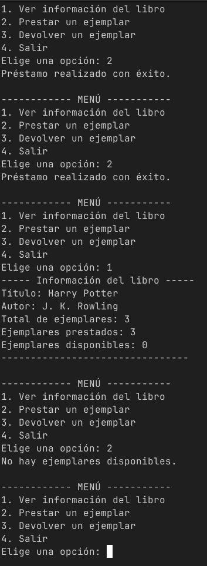
---

## 10. Calculadora con menú usando switch (medio)

**Enunciado**
Crea un programa que muestre un menú:

- Sumar
- Restar
- Multiplicar
- Dividir
- Salir
Cada opción pide dos números y muestra el resultado.
En la opción de división, valida que el divisor no sea 0 y maneja el error (mensaje
y volver a pedir divisor válido).
Usa do-while para repetir el menú hasta que el usuario elija salir.
**Codigo**

``` java
import java.util.Scanner;

public class Ejercicio10 {
  public static void main(String[] args) {
    Scanner sc = new Scanner(System.in);
    int opcion;
    do {
      System.out.println("\n--- MENÚ ---");
      System.out.println("1. Sumar");
      System.out.println("2. Restar");
      System.out.println("3. Multiplicar");
      System.out.println("4. Dividir");
      System.out.println("5. Salir");
      System.out.print("Elige una opción: ");
      opcion = sc.nextInt();
      double a, b;
      switch (opcion) {
        case 1:
          System.out.print("Ingresa el primer número: ");
          a = sc.nextDouble();
          System.out.print("Ingresa el segundo número: ");
          b = sc.nextDouble();
          System.out.println("Suma: " + (a + b));
          break;
        case 2:
          System.out.print("Ingresa el primer número: ");
          a = sc.nextDouble();
          System.out.print("Ingresa el segundo número: ");
          b = sc.nextDouble();
          System.out.println("Resta: " + (a - b));
          break;
        case 3:
          System.out.print("Ingresa el primer número: ");
          a = sc.nextDouble();
          System.out.print("Ingresa el segundo número: ");
          b = sc.nextDouble();
          System.out.println("Multiplicación: " + (a * b));
          break;
        case 4:
          System.out.print("Ingresa el dividendo: ");
          a = sc.nextDouble();
          do {
            System.out.print("Ingresa el divisor: ");
            b = sc.nextDouble();

            if (b == 0) {
              System.out.println("Error: no se puede dividir entre cero. Ingresa otro divisor.");
            }
          } while (b == 0);
          System.out.println("División: " + a + " / " + b + " = " + (a / b));
          break;
        case 5:
          System.out.println("Saliendo del programa...");
          break;
        default:
          System.out.println("Opción no válida.");
      }
    } while (opcion != 5);
  }
}
```

**Salida esperada (resumen)**
---

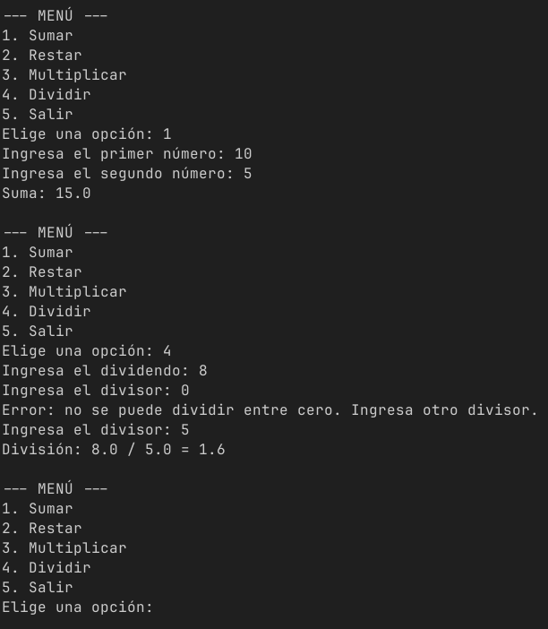
---

## 11. Arreglo de productos con precio final (medio–alto)

**Enunciado**
Crea una clase Producto con atributos privados: nombre (String), costo (double),
impuesto (double, %).
Incluye getters, setters y un método calcularPrecio(double utilidad) que regrese el
precio final (costo + utilidad + impuesto).
En main:
Pide al usuario cuántos productos va a capturar (máximo 5).
Usa un arreglo de Producto para almacenarlos.
Para cada producto, pide nombre, costo, impuesto, con manejo de errores en los
números.
Luego pide un porcentaje de utilidad general para todos.
Muestra una tabla con: nombre, costo, impuesto, precio final.
**Entrada (ejemplo)**
**Salida esperada (resumen)**

```java
import java.util.Scanner;

class Producto {
  private String nombre;
  private double costo;
  private double impuesto; // porcentaje

  public Producto(String nombre, double costo, double impuesto) {
    this.nombre = nombre;
    this.costo = costo;
    this.impuesto = impuesto;
  }

  public String getNombre() {
    return nombre;
  }

  public void setNombre(String nombre) {
    this.nombre = nombre;
  }

  public double getCosto() {
    return costo;
  }

  public void setCosto(double costo) {
    this.costo = costo;
  }

  public double getImpuesto() {
    return impuesto;
  }

  public void setImpuesto(double impuesto) {
    this.impuesto = impuesto;
  }

  public double calcularPrecio(double utilidad) {
    double ganancia = costo * (utilidad / 100);
    double iva = (costo + ganancia) * (impuesto / 100);
    return costo + ganancia + iva;
  }
}

public class Ejercicio11 {
  public static void main(String[] args) {
    Scanner sc = new Scanner(System.in);
    int n = 0;
    do {
      try {
        System.out.print("¿Cuántos productos vas a capturar? (máx 5): ");
        n = sc.nextInt();
        if (n <= 0 || n > 5) {
          System.out.println("Error: el número debe estar entre 1 y 5.");
        }
      } catch (Exception e) {
        System.out.println("Error: ingresa un número válido.");
        sc.next(); // limpiar buffer
      }
    } while (n <= 0 || n > 5);
    Producto[] productos = new Producto[n];
    sc.nextLine(); // limpiar salto de línea
    for (int i = 0; i < n; i++) {
      System.out.println("\nProducto " + (i + 1));
      System.out.print("Nombre: ");
      String nombre = sc.nextLine();
      double costo = 0;
      double impuesto = 0;
      while (true) {
        try {
          System.out.print("Costo: ");
          costo = sc.nextDouble();
          System.out.print("Impuesto (%): ");
          impuesto = sc.nextDouble();
          if (costo < 0 || impuesto < 0) {
            System.out.println("Los valores no pueden ser negativos.");
            continue;
          }
          break;
        } catch (Exception e) {
          System.out.println("Error: ingresa valores numéricos.");
          sc.next(); // limpiar buffer
        }
      }
      productos[i] = new Producto(nombre, costo, impuesto);
      sc.nextLine(); // limpiar buffer
    }
    double utilidad = 0;
    while (true) {
      try {
        System.out.print("\nPorcentaje de utilidad: ");
        utilidad = sc.nextDouble();
        if (utilidad < 0) {
          System.out.println("La utilidad no puede ser negativa.");
          continue;
        }
        break;
      } catch (Exception e) {
        System.out.println("Error: ingresa un número válido.");
        sc.next();
      }
    }
    System.out.println("\n--- LISTA DE PRODUCTOS ---");
    for (Producto p : productos) {
      System.out.println(
          "Producto: " + p.getNombre() +
              " | Costo: " + p.getCosto() +
              " | Impuesto: " + p.getImpuesto() +
              " | Precio final: " + p.calcularPrecio(utilidad));
    }
  }
}
```

---

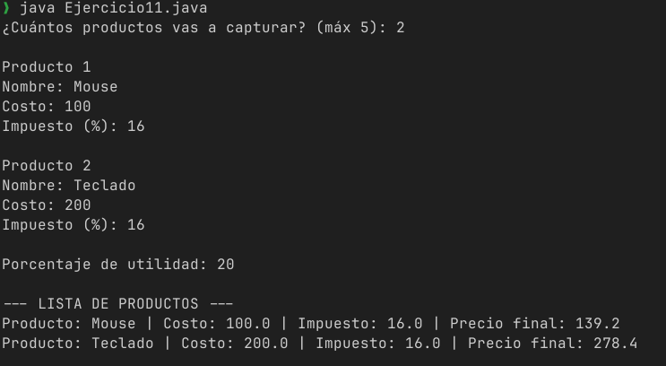
---

## 12. Verificar si una frase es palíndromo (medio–alto)

**Enunciado**
Pide una frase al usuario.
Remueve espacios y conviértela a minúsculas.
Luego, verifica si se lee igual de izquierda a derecha y de derecha a izquierda
(palíndromo).
No uses métodos de librerías que ya lo hagan directo: trabaja con índices o un
arreglo de caracteres y un ciclo for o while.
**Codigo**

```java
import java.util.Scanner;

public class Ejercicio12 {
  public static void main(String[] args) {
    Scanner sc = new Scanner(System.in);
    System.out.print("Frase: ");
    String frase = sc.nextLine();
    String limpia = "";
    for (int i = 0; i < frase.length(); i++) {
      char c = frase.charAt(i);
      if (c != ' ') {
        if (c >= 'A' && c <= 'Z') {
          c = (char) (c + 32);
        }
        limpia += c;
      }
    }
    boolean esPalindromo = true;
    int izquierda = 0;
    int derecha = limpia.length() - 1;
    while (izquierda < derecha) {
      if (limpia.charAt(izquierda) != limpia.charAt(derecha)) {
        esPalindromo = false;
        break;
      }
      izquierda++;
      derecha--;
    }
    if (esPalindromo) {
      System.out.println("La frase es un palíndromo.");
    } else {
      System.out.println("La frase NO es un palíndromo.");
    }
  }
}
```

**Salida esperada**
---

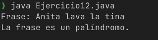
---

## 13. Matriz de notas (medio–alto)

**Enunciado**
Un grupo tiene f estudiantes y cada uno tiene c materias.
Pide f y c (por ejemplo máximo 5x5).
Crea una matriz double[f][c] con las calificaciones.
Luego:
Calcula y muestra el promedio de cada estudiante.
Calcula y muestra el promedio de cada materia.
**Entrada (ejemplo)**

```java  
import java.util.Scanner;

public class Ejercicio13 {
  public static void main(String[] args) {
    Scanner sc = new Scanner(System.in);
    int f, c;
    do {
      System.out.print("Número de estudiantes (máx 5): ");
      f = sc.nextInt();
      System.out.print("Número de materias (máx 5): ");
      c = sc.nextInt();
      if (f <= 0 || f > 5 || c <= 0 || c > 5) {
        System.out.println("Error: valores permitidos de 1 a 5.");
      }
    } while (f <= 0 || f > 5 || c <= 0 || c > 5);
    double[][] notas = new double[f][c];
    for (int i = 0; i < f; i++) {
      System.out.println("Estudiante " + i + ":");
      for (int j = 0; j < c; j++) {
        System.out.print("  Materia " + j + ": ");
        notas[i][j] = sc.nextDouble();
      }
    }
    for (int i = 0; i < f; i++) {
      double suma = 0;
      for (int j = 0; j < c; j++) {
        suma += notas[i][j];
      }
      System.out.println("Promedio estudiante " + i + ": " + (suma / c));
    }
    for (int j = 0; j < c; j++) {
      double suma = 0;
      for (int i = 0; i < f; i++) {
        suma += notas[i][j];
      }
      System.out.println("Promedio materia " + j + ": " + (suma / f));
    }
  }
}
```

**Salida esperada**
---

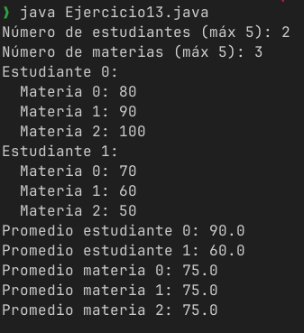
---

## 14. Sistema simple de login con intentos limitados (medio–alto)

**Enunciado**
Define, en el código, un usuario y contraseña correctos (por ejemplo, "admin" y
"1234").
Pide al usuario que ingrese usuario y contraseña, y valida con equals.
Permite máximo 3 intentos.
Si los datos son correctos, muestra "Acceso concedido" y termina.
Si se alcanzan 3 intentos fallidos, muestra "Cuenta bloqueada" y termina.
Usa un ciclo while o for para contar intentos.
**Entrada (ejemplo)**

```java
import java.util.Scanner;

public class Ejercicio14 {
  public static void main(String[] args) {
    Scanner sc = new Scanner(System.in);
    String usuarioCorrecto = "admin";
    String contrasenaCorrecta = "1234";
    int intentos = 3;
    while (intentos > 0) {
      System.out.print("Usuario: ");
      String usuario = sc.nextLine();
      System.out.print("Contraseña: ");
      String contrasena = sc.nextLine();
      if (usuario.equals(usuarioCorrecto) &&
          contrasena.equals(contrasenaCorrecta)) {
        System.out.println("Acceso concedido.");
        sc.close();
        return;
      } else {
        intentos--;
        if (intentos > 0) {
          System.out.println(
              "Datos incorrectos. Te quedan " + intentos + " intentos.");
        }
      }
    }
    System.out.println("Cuenta bloqueada.");
  }
}
```

**Salida esperada**
---

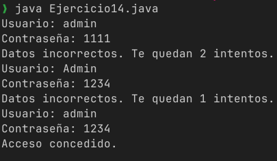
---

## 15. Gestión de inventario con clase y menú (difícil)

**Enunciado**
Crea una clase Articulo con:
Atributos privados: codigo (String), descripcion (String), precio (double),
existencia (int).
Getters y setters.
Método mostrar() que imprima todos los datos.
Método actualizarExistencia(int cantidad) que sume la cantidad a existencia (puede
ser negativa para "vender").
Si la operación dejaría existencia negativa, no la hagas y avisa con un mensaje.
En main:
Define un arreglo de Articulo de tamaño fijo (por ejemplo 5).
Crea un menú con do-while y switch:

- Agregar artículo (en la primera posición libre del arreglo).
- Mostrar todos los artículos (solo los no nulos).
- Vender artículo: pide código y cantidad, busca el artículo en el arreglo, y usa
actualizarExistencia(-cantidad) validando que haya suficiente.
- Reabastecer artículo: similar a vender, pero suma existencias.
- Salir.
Usa manejo de errores para lectura numérica (precio, existencia, cantidad).
**Entrada (ejemplo, flujo reducido)**

```java
import java.util.Scanner;

class Articulo {
  private String codigo;
  private String descripcion;
  private double precio;
  private int existencia;

  public Articulo(String codigo, String descripcion, double precio, int existencia) {
    this.codigo = codigo;
    this.descripcion = descripcion;
    this.precio = precio;
    this.existencia = existencia;
  }

  public String getCodigo() {
    return codigo;
  }

  public void setCodigo(String codigo) {
    this.codigo = codigo;
  }

  public String getDescripcion() {
    return descripcion;
  }

  public void setDescripcion(String descripcion) {
    this.descripcion = descripcion;
  }

  public double getPrecio() {
    return precio;
  }

  public void setPrecio(double precio) {
    this.precio = precio;
  }

  public int getExistencia() {
    return existencia;
  }

  public void mostrar() {
    System.out.println(
        "Código: " + codigo +
            ", Descripción: " + descripcion +
            ", Precio: " + precio +
            ", Existencia: " + existencia);
  }

  public boolean actualizarExistencia(int cantidad) {
    if (existencia + cantidad < 0) {
      System.out.println("No hay suficiente existencia para vender esa cantidad.");
      return false;
    }
    existencia += cantidad;
    return true;
  }
}

public class Ejercicio15 {
  public static void main(String[] args) {
    Scanner sc = new Scanner(System.in);
    Articulo[] inventario = new Articulo[5];
    int opcion = 0;
    do {
      System.out.println("\n--- MENÚ ---");
      System.out.println("1. Agregar artículo");
      System.out.println("2. Mostrar artículos");
      System.out.println("3. Vender artículo");
      System.out.println("4. Reabastecer artículo");
      System.out.println("5. Salir");
      System.out.print("Elige una opción: ");
      try {
        opcion = sc.nextInt();
      } catch (Exception e) {
        System.out.println("Opción inválida.");
        sc.next();
        continue;
      }
      switch (opcion) {
        case 1:
          int posLibre = -1;
          for (int i = 0; i < inventario.length; i++) {
            if (inventario[i] == null) {
              posLibre = i;
              break;
            }
          }
          if (posLibre == -1) {
            System.out.println("Inventario lleno.");
            break;
          }
          sc.nextLine();
          System.out.print("Código: ");
          String codigo = sc.nextLine();
          System.out.print("Descripción: ");
          String desc = sc.nextLine();
          double precio;
          int existencia;
          try {
            System.out.print("Precio: ");
            precio = sc.nextDouble();
            System.out.print("Existencia: ");
            existencia = sc.nextInt();
            if (precio < 0 || existencia < 0) {
              System.out.println("Precio y existencia deben ser positivos.");
              break;
            }
            inventario[posLibre] = new Articulo(codigo, desc, precio, existencia);
            System.out.println("Artículo agregado correctamente.");
          } catch (Exception e) {
            System.out.println("Error en datos numéricos.");
            sc.next();
          }
          break;
        case 2:
          boolean hayArticulos = false;
          for (Articulo a : inventario) {
            if (a != null) {
              a.mostrar();
              hayArticulos = true;
            }
          }
          if (!hayArticulos) {
            System.out.println("No hay artículos registrados.");
          }
          break;
        case 3:
          sc.nextLine();
          System.out.print("Código del artículo: ");
          String codVenta = sc.nextLine();
          Articulo artVenta = buscarArticulo(inventario, codVenta);
          if (artVenta == null) {
            System.out.println("Artículo no encontrado.");
            break;
          }
          try {
            System.out.print("Cantidad a vender: ");
            int cantidad = sc.nextInt();
            if (cantidad <= 0) {
              System.out.println("Cantidad inválida.");
              break;
            }
            if (artVenta.actualizarExistencia(-cantidad)) {
              System.out.println(
                  "Venta realizada. Nueva existencia: " +
                      artVenta.getExistencia());
            }
          } catch (Exception e) {
            System.out.println("Cantidad inválida.");
            sc.next();
          }
          break;
        case 4:
          sc.nextLine();
          System.out.print("Código del artículo: ");
          String codReab = sc.nextLine();
          Articulo artReab = buscarArticulo(inventario, codReab);
          if (artReab == null) {
            System.out.println("Artículo no encontrado.");
            break;
          }
          try {
            System.out.print("Cantidad a agregar: ");
            int cantidad = sc.nextInt();
            if (cantidad <= 0) {
              System.out.println("Cantidad inválida.");
              break;
            }
            artReab.actualizarExistencia(cantidad);
            System.out.println(
                "Reabastecimiento exitoso. Nueva existencia: " +
                    artReab.getExistencia());
          } catch (Exception e) {
            System.out.println("Cantidad inválida.");
            sc.next();
          }
          break;
        case 5:
          System.out.println("Saliendo");
          break;
        default:
          System.out.println("Opción no válida.");
      }
    } while (opcion != 5);
  }

  private static Articulo buscarArticulo(Articulo[] arr, String codigo) {
    for (Articulo a : arr) {
      if (a != null && a.getCodigo().equals(codigo)) {
        return a;
      }
    }
    return null;
  }
}
```

**Salida esperada (resumen)**
---

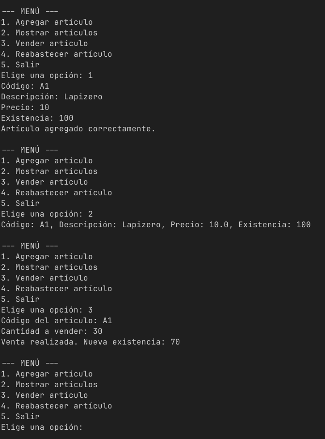
